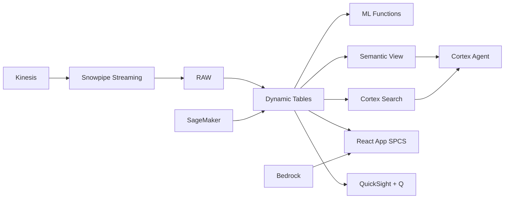

# E-Commerce Marketplace Analytics

Seller and buyer intelligence for Indonesia's US$82B e-commerce market — ML.FORECAST projects GMV growth, Dynamic Tables build real-time marketplace dashboards, and Cortex AI generates seller recommendations.

## Architecture

Indonesia's e-commerce market has reached US$82 billion — the largest in Southeast Asia. A leading marketplace platform manages 500,000 sellers and 10 million active buyers, but faces rising competition, seller churn among high-value merchants, and the need to optimize Harbolnas (12.12) — the year's biggest shopping event worth Rp 18 trillion in GMV.



## Snowflake Capabilities

| Capability | Implementation |
|-----------|---------------|
| Dynamic Tables | GMV_DASHBOARD / SELLER_HEALTH_SCORE / DEMAND_SIGNALS / CAMPAIGN_ROI |
| ML Functions | ML.FORECAST |
| Cortex AI | COMPLETE, AI_CLASSIFY, SUMMARIZE |
| Cortex Search | 150 documents indexed |
| Cortex Agent | MARKETPLACE_INTELLIGENCE_AGENT |
| Semantic View | MARKETPLACE_ANALYTICS |
| React App (SPCS) | 5 tabs + DemoGuide |


## AWS Services

| Service | Role in Demo |
|---------|-------------|
| Amazon Kinesis | Stream real-time order events and clickstream data |
| Amazon Personalize | Product recommendations and personalized search |
| AWS Glue | ETL for order, seller, and product data transformation |
| Amazon SageMaker | Demand forecasting and seller churn prediction models |
| Amazon Bedrock (Claude) | Generate seller growth recommendations and category insights |
| Amazon QuickSight + Q | Marketplace operations dashboard with natural language |


## Personas

| Persona | Role | Key Questions |
|---------|------|---------------|
| **Kevin Susanto** | VP Marketplace Operations | "What's our GMV run-rate this quarter?" "Which seller cohorts are underperforming?" |
| **Maya Anggraini** | Data Science Lead | "Which categories are trending up vs last quarter?" "Show me the seller churn prediction by tier." |


## Data

| Table | Rows | Description |
|-------|------|-------------|
| ORDERS | 50,000,000 | 12 months of marketplace orders with GMV, category, and fulfillment data |
| SELLERS | 500,000 | Marketplace seller profiles with tier, performance metrics, and health score |
| BUYERS | 10,000,000 | Buyer profiles with purchase history, RFM segmentation, and lifetime value |
| PRODUCTS | 20,000,000 | Product catalog with pricing, category, and search ranking data |
| CAMPAIGNS | 10,000 | Promotional campaigns, vouchers, and flash sale records |
| SELLER_DOCS | 150 | Seller guidelines, policy documents, and category playbooks |


## Build Instructions

### Prerequisites
- Snowflake account with ACCOUNTADMIN access
- Cortex AI enabled (ML Functions, Search, Agent)
- Warehouse: ECOM_WH (Medium)
- AWS CLI with access (us-west-2)

### Deployment

```bash
snowsql -f snowflake/00_setup.sql
snowsql -f snowflake/01_marketplace_install.sql
snowsql -f snowflake/02_raw_tables.sql
snowsql -f snowflake/03_staging.sql
snowsql -f snowflake/04_dynamic_tables.sql
snowsql -f snowflake/05_search.sql
snowsql -f snowflake/06_ml_models.sql
snowsql -f snowflake/07_semantic_view.sql
snowsql -f snowflake/08_agent.sql
```

### React App (SPCS)
```bash
cd app && npm ci && npm run build
docker build -t aws-indonesia-digital-economy-ecommerce-app .
docker push bdiqc8sm-default.registry.snowflakecomputing.com/ecommerce_analytics/app/aws_indonesia_digital_economy_ecommerce/app:latest
```

### Demo Mode
Open the app URL with `?demo=true` for presenter view.

## Build Modes

### Snowflake Only
Run scripts 00-08 (skip AWS-specific integration). Uses:
- **Snowpipe Streaming SDK** instead of Amazon Kinesis
- **Cortex Complete + ML.FORECAST** instead of Amazon Personalize
- **Dynamic Tables** instead of AWS Glue
- **ML.FORECAST** instead of Amazon SageMaker
- **Cortex Complete** instead of Amazon Bedrock (Claude)
- **Snowflake Intelligence (Cortex Analyst)** instead of Amazon QuickSight + Q

### Full AWS + Snowflake
Run all scripts including AWS integration. Deploy QuickSight dashboard from `quicksight/`.

## Business Impact

Industry research and Snowflake customer outcomes:
- **Indonesia's e-commerce GMV reached $62B in 2024 — largest in Southeast Asia, growing 15% annually** — [Google/Temasek e-Conomy SEA 2024](https://economysea.withgoogle.com/)
- **Tokopedia (now merged with TikTok Shop) and Shopee process 2B+ transactions annually across 17,000 islands** — [Tech in Asia](https://www.techinasia.com/tokopedia-tiktok-indonesia-ecommerce)
- **Last-mile delivery costs in Indonesia are 2-3x global average due to archipelago geography — AI routing reduces 20%** — [McKinsey Indonesia](https://www.mckinsey.com/id/our-insights)
- **Bukalapak uses Snowflake for real-time marketplace analytics serving 100M+ users** — [Snowflake Customers](https://www.snowflake.com/en/customers/all-customers/)

## Key Demo Numbers

- **Rp 120T GMV** annual gross merchandise value (28% YoY growth)
- **500K sellers** marketplace merchants across all categories
- **10M buyers** active buyers in trailing 12 months
- **3,200 at-risk** high-value sellers with elevated churn score
- **50M orders/month** monthly transaction volume at peak


## License

Apache 2.0 — See [LICENSE](LICENSE) for details.

This is a personal demo project and is not an official Snowflake offering. It comes with no support or warranty.