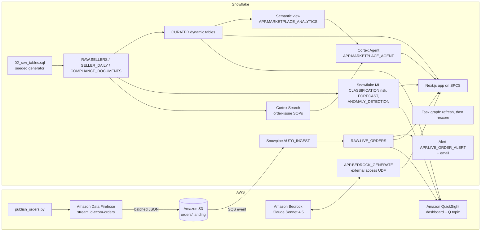

# Indonesia Online Marketplace - Order Issues and Seller Operations

End-to-end marketplace operations for **40 fictional sellers on a fictional Indonesian online marketplace, shipping from 5 cities** (Jakarta, Surabaya, Bandung, Medan, Makassar) using Snowflake, optionally with AWS: from a live order issue to a 7-day order-cancellation risk score, an alert email and an AI action memo for the marketplace operations team.

## Architecture

A marketplace-operations pipeline built on **Snowflake** (Dynamic Tables, Snowflake ML, Cortex Search, Cortex Agent, Cortex AI_COMPLETE, SPCS) and, in the full build, **AWS** (Amazon Data Firehose, S3, Bedrock Claude, QuickSight + Amazon Q). Order events land in `RAW.LIVE_ORDERS`. Dynamic tables curate 90 days of seller-day history: orders processed, GMV, order issues raised, cancelled orders, late deliveries, clean order rate and stock sync compliance. Snowflake ML scores 7-day order-cancellation risk per seller, forecasts marketplace-wide order-issue volume and flags return rate anomalies. A Cortex Agent answers questions with SOP citations, and an LLM drafts the operations action memo.

Interactive diagrams (hover for object names): [Snowflake only](docs/architecture-snowflake.html) | [AWS + Snowflake](docs/architecture-aws.html). The app shows both on its Architecture & Data tab, the current build first. Regenerate them with `python3 docs/build_architecture.py`.


```mermaid
flowchart LR
    subgraph AWS
      SIM[publish_orders.py] --> FH[Amazon Data Firehose<br/>stream id-ecom-orders]
      FH -->|batched JSON| S3[(Amazon S3<br/>orders/ landing)]
      BR[Amazon Bedrock<br/>Claude Sonnet 4.5]
      QS[Amazon QuickSight<br/>dashboard + Q topic]
    end
    subgraph Snowflake
      S3 -->|SQS event| PIPE[Snowpipe AUTO_INGEST] --> LIVE[RAW.LIVE_ORDERS]
      GEN[02_raw_tables.sql<br/>seeded generator] --> RAW[RAW.SELLERS / SELLER_DAILY / COMPLIANCE_DOCUMENTS]
      RAW --> DT[CURATED dynamic tables]
      RAW --> ML[Snowflake ML<br/>CLASSIFICATION risk, FORECAST,<br/>ANOMALY_DETECTION]
      DT --> SV[Semantic view<br/>APP.MARKETPLACE_ANALYTICS]
      RAW --> CS[Cortex Search<br/>order-issue SOPs]
      SV --> AG[Cortex Agent<br/>APP.MARKETPLACE_AGENT]
      CS --> AG
      LIVE --> AL[Alert APP.LIVE_ORDER_ALERT<br/>+ email]
      UDF[APP.BEDROCK_GENERATE<br/>external access UDF]
      TK[Task graph: refresh, then rescore]
      APP[Next.js app on SPCS]
    end
    BR <--> UDF
    DT --> APP
    ML --> APP
    LIVE --> APP
    AG --> APP
    UDF --> APP
    DT --> QS
    ML --> QS
    LIVE --> QS
```

The Snowflake-only build drops the AWS subgraph: `APP.SIMULATE_ORDERS` writes to `RAW.LIVE_ORDERS`, and the app calls Cortex `AI_COMPLETE` instead of the Bedrock UDF.

## Snowflake Capabilities

| Capability | Implementation |
|-----------|---------------|
| Dynamic Tables | `CURATED.KPI_SUMMARY`, `PERFORMANCE_SUMMARY`, `ISSUE_SUMMARY`, `TREND_ANALYSIS` from the RAW tables |
| Snowflake ML | CLASSIFICATION 7-day order-cancellation risk (`ML.CANCEL_RISK_SCORES`), 14-day order-issue FORECAST, return rate ANOMALY_DETECTION |
| Cortex Search | 14 synthetic order-issue handling SOPs (one per product category and issue type) in `SEARCH.ISSUE_SOP_SEARCH` |
| Semantic View | `APP.MARKETPLACE_ANALYTICS` over sellers, issue types, daily totals and risk |
| Cortex Agent | `APP.MARKETPLACE_AGENT`: Cortex Analyst over the semantic view plus Cortex Search for SOP citations |
| Cortex AI | `AI_COMPLETE('claude-sonnet-4-5')` for grounded answers, and for the action memo in the Snowflake-only build |
| Alerts + Tasks | `APP.LIVE_ORDER_ALERT` logs ISSUE events and sends email; task graph `TASK_REFRESH_CURATED`, then `TASK_RESCORE_RISK` |
| Snowpark Container Services | Next.js app `APP.ID_ECOM_APP` with 6 tabs: Executive Cockpit, Predictive, Controls, Live Orders, Ask AI, Architecture & Data |
| Snowpipe | `RAW.LIVE_ORDERS_PIPE` AUTO_INGEST from S3 (AWS build only) |

## AWS Services

Used only in the AWS + Snowflake build.

| Service | Role in Demo |
|---------|-------------|
| Amazon Data Firehose | Direct PUT stream `id-ecom-orders` receives simulated order events and writes batches to S3 |
| Amazon S3 | Landing bucket (`orders/`). An event notification goes to the Snowpipe SQS queue |
| Amazon Bedrock | Claude Sonnet 4.5 writes the action memo, called from Snowflake through an external-access UDF |
| Amazon QuickSight | DIRECT_QUERY executive dashboard over Snowflake (daily order issues, cancelled orders by seller, order-cancellation risk) |
| Amazon Q | Natural-language questions over the QuickSight topic `id-ecom-topic` |
| AWS IAM | Least-privilege roles for S3, Firehose and Bedrock |

## Personas

These personas are fictional.

| Persona | Role | Key Questions |
|---------|------|---------------|
| **Dewi Kartika** | Head of Marketplace Operations | "What is our clean order rate?" "Which issue types turn into cancelled orders?" |
| **Rizky Pratama** | Seller Quality Analyst | "Which sellers are high risk this week, and which SOP applies?" |

## Data

All data is synthetic and seeded, so every rebuild reproduces it. The marketplace, sellers and names are fictional; the cities are real Indonesian cities used as regions.

| Table | Rows | Description |
|-------|------|-------------|
| RAW.SELLERS | 40 | Sellers in 5 cities and 5 categories (Fashion, Electronics, Home and living, Health and beauty, Groceries), with fulfilment risk tier |
| RAW.SELLER_DAILY | 3,600 | Daily seller observations over 90 days: orders, GMV (IDR), order issues, cancelled orders, late deliveries, issue type, stock syncs, return rate and time to dispatch |
| RAW.COMPLIANCE_DOCUMENTS | 40 | Required, on-file and pending seller compliance documents per seller |
| SEARCH.ISSUE_DOCS | 14 | Synthetic order-issue handling SOPs indexed for Cortex Search |
| RAW.LIVE_ORDERS | Grows during the demo | Live order events from Firehose (AWS build) or `APP.SIMULATE_ORDERS` (Snowflake-only build) |
| ML.CANCEL_RISK_SCORES | 40 | 7-day order-cancellation probability and risk band per seller |
## Build Instructions

### Prerequisites
- Snowflake account with ACCOUNTADMIN access, and Cortex AI enabled (AI_COMPLETE, Search, Agent).
- An X-Small warehouse with auto-suspend at or below 120 s, and an existing SPCS compute pool.
- Python 3.11+, `snowflake-connector-python`, Node.js 22+, Docker and the `snow` CLI.
- App image: run `snow spcs image-registry login`, then build and push `id-ecom-app:v1` to the database's `APP.IMAGES` repository (see the header of `snowflake/07_deploy_app.sql`).
- AWS build only: `boto3`, AWS credentials for the target account (us-west-2) with Bedrock access, and QuickSight Enterprise.

### SPCS App
```
<DATABASE>.APP.ID_ECOM_APP
```

### Tests
```bash
python -m pytest aws snowflake quicksight
```

For a local run, put `SNOWFLAKE_ACCOUNT`, `SNOWFLAKE_USER`, `SNOWFLAKE_DATABASE`, `SNOWFLAKE_WAREHOUSE`, `SNOWFLAKE_AUTHENTICATOR=PROGRAMMATIC_ACCESS_TOKEN`, `SNOWFLAKE_TOKEN` and `DEMO_PLATFORM` in the environment, then run `npm --prefix app run build && npm --prefix app start`.

## Build Modes

Both modes share the same core. They differ in three places, and the app's `DEMO_PLATFORM` setting (in its SPCS spec) switches the memo provider and the Live Orders tab.

| Layer | Snowflake Only | Full AWS + Snowflake |
|---|---|---|
| Live orders | `CALL APP.SIMULATE_ORDERS(n)` inserts simulated order events into `RAW.LIVE_ORDERS`. This simulates an order feed; it is not Snowpipe Streaming | `aws/publish_orders.py` to Amazon Data Firehose, then S3, SQS and Snowpipe AUTO_INGEST |
| Action memo | Cortex `AI_COMPLETE('claude-sonnet-4-5')` | Amazon Bedrock Claude Sonnet 4.5 through `APP.BEDROCK_GENERATE` |
| BI and natural-language questions | The SPCS app is the dashboard; questions go to the Cortex Agent | Also a QuickSight dashboard and an Amazon Q topic |
| App setting | `DEMO_PLATFORM: snowflake` | `DEMO_PLATFORM: aws` |

### Snowflake Only

```bash
# 1. Core data and dynamic tables (guarded: new isolated database only)
python snowflake/run_core.py --database INDONESIA_ECOMMERCE_SNOWFLAKE --warehouse <XS_WAREHOUSE> --connection <CONNECTION> --apply
# 2. Native order feed, ML, search, semantic view, agent, alert and task graph
python snowflake/run_intelligence.py --database INDONESIA_ECOMMERCE_SNOWFLAKE --platform snowflake --warehouse <XS_WAREHOUSE> --connection <CONNECTION> --alert-email you@example.com
# 3. App on SPCS with DEMO_PLATFORM=snowflake (push the image first)
python snowflake/run_intelligence.py --database INDONESIA_ECOMMERCE_SNOWFLAKE --platform snowflake --warehouse <XS_WAREHOUSE> --connection <CONNECTION> --alert-email you@example.com --files 07_deploy_app.sql --compute-pool <COMPUTE_POOL>
```

During the demo:
- Run `CALL APP.SIMULATE_ORDERS(20)` to add live order events. For a continuous feed, run `ALTER TASK APP.TASK_SIMULATE_ORDERS RESUME`, and `SUSPEND` it afterwards.
- Run `EXECUTE ALERT APP.LIVE_ORDER_ALERT` to raise the alert email.
- Run `EXECUTE TASK APP.TASK_REFRESH_CURATED` to refresh the curated tables and rescore risk.

Afterwards, drop the database or run `ALTER SERVICE APP.ID_ECOM_APP SUSPEND`.

### Full AWS + Snowflake

```bash
# 1. Core data and dynamic tables (guarded: new isolated database only)
python snowflake/run_core.py --database INDONESIA_ECOMMERCE_AWS --warehouse <XS_WAREHOUSE> --connection <CONNECTION> --apply
# 2. AWS ingestion and Bedrock (dry run first, then --apply)
python aws/setup_aws.py --database INDONESIA_ECOMMERCE_AWS --account <AWS_ACCOUNT_ID> --connection <CONNECTION> --apply
# 3. ML, search, semantic view, agent, alert and task graph
python snowflake/run_intelligence.py --database INDONESIA_ECOMMERCE_AWS --platform aws --warehouse <XS_WAREHOUSE> --connection <CONNECTION> --alert-email you@example.com
# 4. App on SPCS with DEMO_PLATFORM=aws (push the image first)
python snowflake/run_intelligence.py --database INDONESIA_ECOMMERCE_AWS --platform aws --warehouse <XS_WAREHOUSE> --connection <CONNECTION> --alert-email you@example.com --files 07_deploy_app.sql --compute-pool <COMPUTE_POOL>
# 5. QuickSight dashboard and Q topic (needs an existing Snowflake data source)
python quicksight/build_dashboards.py --database INDONESIA_ECOMMERCE_AWS --account <AWS_ACCOUNT_ID> --principal-arn <QUICKSIGHT_USER_ARN> --data-source-arn <DATA_SOURCE_ARN> --prefix id-ecom --apply --update --with-topic
```

QuickSight objects must be shared with the QuickSight user who signs in (`--principal-arn`); otherwise the console shows nothing.

During the demo:
- Run `python aws/publish_orders.py --count 20` to send live order events. Firehose buffers for up to 60 seconds before writing to S3.
- Run `EXECUTE ALERT APP.LIVE_ORDER_ALERT` to raise the alert email.
- Run `EXECUTE TASK APP.TASK_REFRESH_CURATED` to refresh the curated tables and rescore risk.

Afterwards, `python aws/teardown_aws.py --database INDONESIA_ECOMMERCE_AWS --account <AWS_ACCOUNT_ID> --connection <CONNECTION> --apply` removes the AWS resources and the account-level Bedrock external-access and S3 storage integrations. It leaves the email integration `ID_ECOM_EMAIL_INT`, which the Snowflake-only build also uses.

## Business Impact

Industry research and Snowflake customer outcomes:
- **Southeast Asia e-commerce is growing again, led by video commerce**: "E-commerce growth surges to +15% year-on-year, propelled by video commerce – which now accounts for 20% of e-commerce GMV, up from less than 5% in 2022" -- [Google, Temasek and Bain & Company, e-Conomy SEA 2024 report](https://services.google.com/fh/files/misc/e_conomy_sea_2024_report.pdf)
- **Petco** (Snowflake customer), a retailer serving millions of monthly web visitors and more than 1,500 stores, "now processes data up to 50% faster with Snowflake", and its "Data science teams have increased productivity by 20%" -- [Snowflake customer story: Petco](https://www.snowflake.com/en/customers/all-customers/case-study/petco/)

## Key Demo Numbers

These figures are synthetic and come from the seeded demo data. Forecast and anomaly figures can shift slightly with the build day.

- **40 sellers** in 5 Indonesian cities across 5 categories, 3,600 seller-days over 90 days; **662,753 orders** worth IDR 233 B GMV
- **Clean order rate 99.91%**: **627 order issues** raised, of which **170** ended as cancelled orders (issue cancellation rate 27.1%); **84 late deliveries**
- **Wrong size or variant** issues produce the most cancelled orders (40 of 83 issues); the 16 courier network disruption issues (Medan and Makassar) are always resolved without cancellation
- **Order-cancellation model** out-of-time holdout: precision 0.41, recall 0.44 at a 0.5 threshold, against a 0.19 base rate. Six sellers are high risk; the top seller is SLR-0005, at 91.1%
- **14-day order-issue forecast** with prediction intervals; **63 of 640** seller-days flagged as return rate anomalies
- **Stock sync compliance 83.3%**, compliance document coverage 84.5%, with 7 documents pending
- **14 SOPs** indexed for Cortex Search and cited by ID in agent answers

## License

Apache 2.0 — See [LICENSE](LICENSE) for details.

This is a personal demo project and is not an official Snowflake offering. It comes with no support or warranty. Industry metrics cited are from publicly available third-party research and Snowflake customer stories; they represent reported outcomes and are not guarantees of results.
